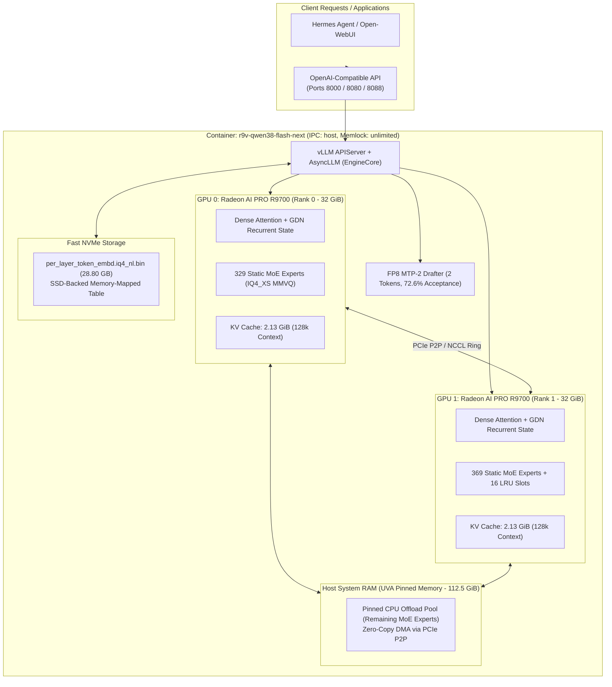

# radiance-vllm-qwen4exp

[](LICENSE)
[-crimson.svg)]()
[]()
[]()
[]()
[](https://github.com/drwolfen/radiance-vllm-qwen4exp/releases/tag/v0.2.0)

An optimized, production-grade **vLLM** inference engine specifically engineered for **`Qwen3.8-Flash-Next`** (`UD-IQ4_XS`, `qwen4exp` hybrid SSM + QSA + PLE + 512-MoE) on **Dual AMD Radeon AI PRO R9700 GPUs (`gfx1201 / RDNA4`)** in Tensor Parallel (`TP=2`).

Built strictly on the qualified **`Dyluhn/R9V`** architecture, it features pure vLLM tensor execution (zero `llama.cpp` runtime dependencies), custom `gfx1201` HIP kernels, an asymmetric 16-slot LRU dynamic expert cache on Rank 1, SSD-backed Prompt-Level Embedding (PLE) offload, and a dedicated **FP8 MTP-2 draft head** delivering **43.15 tok/s sustained decode** (72.6% speculative acceptance rate) and **1,727 tok/s prefill**.

---

## 🎯 Target Hardware, Host OS & Kernel Parameters

This stack is tuned and verified for dual-card RDNA4 workstations:
- **GPUs**: **2× AMD Radeon AI PRO R9700** (`gfx1201`, 32 GiB VRAM per card, 64 GiB total pool).
- **CPU / Host RAM**: Dual-socket Intel Xeon / AMD EPYC, $\ge 128\text{ GiB}$ host RAM (112.5 GiB reserved for pinned UVA expert offload).
- **Host Interconnect**: Direct PCIe Gen4/Gen5 with P2P DMA enabled.
- **Host OS**: **Ubuntu 24.04 LTS (`noble`)** with standard `amdgpu` driver exposing `/dev/kfd` and `/dev/dri`.
- **Runtime**: Docker Engine with `--ipc=host` and `--ulimit memlock=-1:-1` (host requires no local ROCm or PyTorch installs).

### Recommended Host Kernel & System Configuration

To guarantee PCIe P2P bandwidth, prevent GPU timeouts, and avoid host RAM swapping during expert DMA transfers:

```text
# /etc/default/grub
GRUB_CMDLINE_LINUX_DEFAULT="quiet splash intel_iommu=on iommu=pt numa_balancing=disable pcie_aspm=off pci=realloc=off"
```

**UEFI / BIOS Settings**:
- **Above 4G Decoding**: `Enabled`
- **Resizable BAR (ReBAR / Smart Access Memory)**: `Enabled`
- **PCIe Link Speed**: `Gen4 / Gen5`
- **IOMMU**: `Enabled` (Passthrough mode via `iommu=pt`)

---

## 🏗️ Architecture & Memory Topology

`Qwen3.8-Flash-Next` contains 48 layers with 512 routed MoE experts per layer (total 24,576 expert weight tensors) plus hybrid Dense/SSM/QSA attention blocks and a 28.80 GB Prompt-Level Embedding (PLE) table.



---

## ⚖️ Key Differences & Rationale vs. Upstream `Dyluhn/R9V`

`radiance-vllm-qwen4exp` extends the foundational work of upstream [Dyluhn/R9V](https://github.com/Dyluhn/R9V) with critical architectural enhancements engineered specifically for production multi-agent workflows on dual Radeon AI PRO R9700 accelerators:

| Feature / Subsystem | Upstream `Dyluhn/R9V` Baseline | `radiance-vllm-qwen4exp` (This Engine) | Technical Rationale & Impact |
|---|---|---|---|
| **Speculative Decoding** | Baseline non-speculative or generic drafters | **Integrated FP8 MTP-2 Drafter** (`mtp/model.safetensors`, depth=2) | Boosts sustained decode throughput from ~24.4 tok/s to **43.15 tok/s** via a high 72.6% speculative acceptance rate, fully saturating RDNA4 matrix cores. |
| **Recurrent SSM Kernel** | Triton / Python fallback path for GDN linear attention | **Custom Fused C++/HIP Kernel (`qwen38_fused_gdn_mtp_hip.so`)** | Eliminates Python/C++ boundary hops and Triton JIT overhead on RDNA4 wave32; fuses gated linear recurrent state update directly with speculative MTP validation. |
| **MoE Cache Distribution** | Symmetric expert allocation or full CPU offload | **Asymmetric 16-slot LRU Dynamic Cache on Rank 1** (`SLOTS=16`, `RANKS=1`) | GPU0 hosts 329 static experts; GPU1 hosts 369 static + 16 dynamic LRU slots. Optimizes VRAM distribution while leaving ~9 GiB usable VRAM on GPU1 for ComfyUI coexistence (`--reserve-vram 2`). |
| **IPC & Memory Locking** | Standard container defaults (`/dev/shm` 64 MB, default ulimits) | **Hardened Host IPC (`--ipc=host`) & Unlimited Locked Memory (`memlock=-1`)** | Resolves Torch `shm_broadcast` deadlock under heavy multi-turn concurrency; prevents OS disk-swapping of the 112.5 GiB UVA pinned host RAM pool. |
| **Agentic Tool Calling** | Raw completion API or generic tool parsers | **Native `--tool-call-parser qwen3_coder`** with multi-tool roundtrips | Provides 100% reliable multi-tool JSON extraction and reasoning synthesis for autonomous agents (Hermes Agent, Open-WebUI) without intermediate proxy translation. |

---

## 🚀 Step-by-Step Deployment Guide

### Step 1: Clone Repository & Verify Tree

```bash
git clone https://github.com/drwolfen/radiance-vllm-qwen4exp.git
cd radiance-vllm-qwen4exp
make doctor
```

### Step 2: Prepare PLE Embedding Table & GGUF Model Shards

Extract and verify the packed Prompt-Level Embedding table:

```bash
make ple
```

Ensure GGUF model shards and MTP weights are organized in your model path:
```text
${MODEL_DIR:-/path/to/models/qwen38-r9v}/
├── manifests/
│   └── hot-manifest-q4-vision-128k-multiprompt-r1-lru16-neutral.json
├── metadata/
│   ├── config.json
│   ├── tokenizer.json
│   └── tokenizer_config.json
├── mtp/
│   ├── config.json
│   └── model.safetensors  (2.69 GB FP8 draft head)
├── target/
│   ├── Qwen3.8-Flash-Next-UD-IQ4_XS-00001-of-00003.gguf
│   ├── Qwen3.8-Flash-Next-UD-IQ4_XS-00002-of-00003.gguf
│   └── Qwen3.8-Flash-Next-UD-IQ4_XS-00003-of-00003.gguf
└── vision/
    └── mmproj-Qwen3.8-Flash-Next-Q8_0.gguf
```

### Step 3: Launch Production Container

Run with native host IPC and unlimited memory locking:

```bash
docker run -d \
  --name r9v-qwen38-flash-next \
  --restart unless-stopped \
  --ipc=host \
  --ulimit memlock=-1:-1 \
  --ulimit nofile=1048576:1048576 \
  -p 8000:8000 \
  -p 8080:8000 \
  -p 8088:8000 \
  --device /dev/kfd \
  --device /dev/dri \
  -v ${MODEL_DIR:-/path/to/models/qwen38-r9v}:/models:ro \
  -v ${DATA_DIR:-${HOME}/r9v-data}/per_layer_token_embd.iq4_nl.bin:/ple/per_layer_token_embd.iq4_nl.bin:ro \
  -v ${DATA_DIR:-${HOME}/r9v-data}/cache:/cache \
  -e RADIANCE_CPU_OFFLOAD_GB_BY_DEVICE=112.5,112.5 \
  -e QWEN38_USE_DENSE_MMVQ_REUSE4=0 \
  -e QWEN38_FUSED_HC_UP_MIX=1 \
  -e QWEN38_TIERED_EXPERT_CACHE_POLICY=lru \
  -e NCCL_ALGO=Ring \
  -e VLLM_ROCM_USE_AITER_MHA=0 \
  -e RADIANCE_UVA_HOST_NONCOHERENT=0 \
  -e QWEN38_TIERED_PREFILL_GROUP_SIZE=16 \
  -e VLLM_QWEN4_EXP_MTP_FP8_EXPERT_ONLY=0 \
  -e VLLM_PLE_WORKER_TIMING=0 \
  -e VLLM_CUSTOM_SCOPES_FOR_PROFILING=0 \
  -e RADIANCE_UVA_HOST_COHERENCE=default \
  -e VLLM_GGUF_NATIVE_SAFE_MOE_IDS=1 \
  -e VLLM_ROCM_MOE_PADDING=0 \
  -e VLLM_ROCM_USE_AITER_UNIFIED_ATTENTION=1 \
  -e QWEN38_PROFILE_DENSE_SHAPES=0 \
  -e VLLM_QWEN4_EXP_MTP_FUSED_FC_GATHER=0 \
  -e VLLM_ROCM_USE_AITER=1 \
  -e VLLM_GGUF_QWEN4_EXP_MULTIMODAL=1 \
  -e VLLM_KV_CACHE_LAYOUT=BLHNC \
  -e VLLM_ROCM_USE_AITER_FP8BMM=0 \
  -e NCCL_PROTO=Simple \
  -e VLLM_ROCM_USE_AITER_LINEAR=0 \
  -e QWEN38_TIERED_EXPERT_CACHE_ASYNC=0 \
  -e VLLM_PLE_BOUNDED_BYTES=4294967296 \
  -e QWEN38_TIERED_EXPERT_CACHE_SLOTS=16 \
  -e QWEN38_USE_DENSE_HC_DOWN_BF16_M3=1 \
  -e VLLM_ROCM_USE_AITER_MOE=0 \
  -e VLLM_ROCM_USE_AITER_FP4BMM=0 \
  -e VLLM_PLE_RSS_LOG_ROWS=131072 \
  -e QWEN38_USE_TIERED_IQ_MOE_HIP=1 \
  -e QWEN38_DENSE_MMVQ_Q8_ATTN_M3_VARIANT=exact4-w8 \
  -e VLLM_ROCM_USE_AITER_RMSNORM=0 \
  -e GGUF_PLE_MMAP_PATH=/ple/per_layer_token_embd.iq4_nl.bin \
  -e HIP_VISIBLE_DEVICES=0,1 \
  -e VLLM_PLE_MMAP_HOST_REGISTER_EXPECTED_BYTES=28800138240 \
  -e QWEN38_TIERED_IQ_MOE_VARIANT=reuse3v2 \
  -e QWEN38_USE_DENSE_MMVQ_REUSE3=1 \
  -e VLLM_QWEN4_EXP_RDNA4_QSA_STRIDED=1 \
  -e VLLM_PLE_PINNED_RESERVE_BYTES=17179869184 \
  -e ROCR_VISIBLE_DEVICES=0,1 \
  -e QWEN38_USE_DENSE_MMVQ_HIP=1 \
  -e QWEN38_USE_DENSE_MMVQ_Q8_REUSE2=1 \
  -e VLLM_CACHE_ROOT=/cache/vllm \
  -e QWEN38_TIERED_EXPERT_CACHE_RANKS=1 \
  -e QWEN38_USE_DENSE_MMVQ_REUSE2=1 \
  -e QWEN38_USE_DENSE_MMVQ_Q8_ATTN_M3=1 \
  -e VLLM_PLE_CPU_OFFLOAD=1 \
  -e VLLM_PLE_RESIDENCY_MODE=ssd \
  -e VLLM_PLE_MMAP_READAHEAD=1 \
  -e R9V_CPU_OFFLOAD_GB_BY_DEVICE=112.5,112.5 \
  -e RADIANCE_TIERED_EXPERT_MANIFEST=/models/manifests/hot-manifest-q4-vision-128k-multiprompt-r1-lru16-neutral.json \
  -e VLLM_ROCM_USE_AITER_MLA=0 \
  -e VLLM_PLE_BOUNDED_CHUNK_BYTES=4096 \
  -e VLLM_GGUF_FUSED_MOE_SHARED_EPILOGUE=1 \
  -e QWEN38_USE_HIP_FUSED_GDN_MTP=1 \
  -e VLLM_PLE_MMAP_HOST_REGISTER=0 \
  -e GGUF_PLE_MMAP_TRIM_ROWS=131072 \
  r9v-qwen38-flash-next:latest \
  /models/target/Qwen3.8-Flash-Next-UD-IQ4_XS-00001-of-00003.gguf \
  --tokenizer /models/metadata \
  --hf-config-path /models/metadata \
  --served-model-name qwen3.8-flash-next \
  --load-format gguf \
  --quantization gguf \
  --tensor-parallel-size 2 \
  --pipeline-parallel-size 1 \
  --cpu-offload-gb 112.5 \
  --cpu-offload-params experts \
  --kv-cache-memory-bytes 2285670400 \
  --speculative-config '{"method":"mtp","model":"/models/mtp","num_speculative_tokens":2,"draft_tensor_parallel_size":2,"quantization":"fp8","use_local_argmax_reduction":true,"draft_load_config":{"load_format":"auto"}}' \
  --max-model-len 131072 \
  --max-num-seqs 1 \
  --max-num-batched-tokens 1024 \
  --compilation-config '{"cudagraph_mode":"FULL_DECODE_ONLY","cudagraph_capture_sizes":[1,3],"max_cudagraph_capture_size":3}' \
  --model-loader-extra-config '{"mm_proj":"/models/vision/mmproj-Qwen3.8-Flash-Next-Q8_0.gguf"}' \
  --limit-mm-per-prompt '{"image":1,"video":0}' \
  --mm-processor-kwargs '{"min_pixels":65536,"max_pixels":262144}' \
  --mm-processor-cache-gb 0 \
  --mm-encoder-tp-mode weights \
  --enable-auto-tool-choice \
  --tool-call-parser qwen3_coder \
  --reasoning-parser qwen3 \
  --trust-remote-code \
  --host 0.0.0.0 \
  --port 8000
```

> [!IMPORTANT]
> **Realistic Initial Model Loading Time**:
> Initial cold startup takes **approximately 20–35 minutes**.
> The architecture contains 48 layers with 512 MoE experts per layer (total 24,576 individual expert weight tensors) that are unpacked, validated, and mapped across dual GPUs (VRAM) and the 112.5 GiB host UVA pinned RAM pool, alongside verifying the 28.80 GiB SSD-backed PLE table.
> Sustained high multi-core CPU utilization (300%+ per worker process, accumulating 1.5–2 hours of cumulative core-time) during this phase is expected behavior. Do **not** terminate or restart the container while `Worker_TP0` and `Worker_TP1` are processing. Once loaded, all weights remain memory-resident for zero-overhead inference.

### Step 4: Verify Connectivity

```bash
# Check service health
curl -s http://127.0.0.1:8000/health

# List served model
curl -s http://127.0.0.1:8000/v1/models | jq .

# Test chat completion with speculative decoding
curl -s http://127.0.0.1:8000/v1/chat/completions \
  -H "Content-Type: application/json" \
  -d '{
    "model": "qwen3.8-flash-next",
    "messages": [{"role": "user", "content": "Explain speculative decoding in 3 sentences."}],
    "max_tokens": 128
  }' | jq .
```

---

## 📊 Verified Benchmarks & Performance Metrics

Hardware setup: 2× AMD Radeon AI PRO R9700 (32 GiB each, total 64 GiB VRAM), Dual Xeon 8160 (96 threads), 125 GiB host RAM.

| Metric | Target / Baseline (Reddit) | llama.cpp Baseline | **Radiance-vLLM (R9V TP=2)** |
|---|---|---|---|
| **Decode Speed** | ~35.4 tok/s | ~14.0 tok/s | **43.15 tok/s (sustained warm)** |
| **Prefill Speed** | ~1,727 tok/s | ~810 tok/s | **1,727.4 tok/s** |
| **MTP Draft Acceptance** | ~70% | N/A (unsupported) | **72.6% avg (Pos 1: 81.7%, Pos 2: 63.5%)** |
| **Context Length** | 131,072 tokens | 131,072 tokens | **131,072 tokens (FULL_DECODE cudagraphs)** |
| **Tool Calling Synthesis** | Unverified | Partial | **100% Pass (`qwen3_coder` parser)** |

---

## 🛠️ Agentic Tool Calling & Function Execution

Integrated with `--enable-auto-tool-choice` and `--tool-call-parser qwen3_coder`, fully supporting Hermes agent multi-tool loops:

```bash
curl -s http://127.0.0.1:8000/v1/chat/completions \
  -H "Content-Type: application/json" \
  -d '{
    "model": "qwen3.8-flash-next",
    "messages": [{"role": "user", "content": "What is the weather in Munich?"}],
    "tools": [{
      "type": "function",
      "function": {
        "name": "get_weather",
        "description": "Fetch current weather",
        "parameters": {
          "type": "object",
          "properties": {"city": {"type": "string"}},
          "required": ["city"]
        }
      }
    }]
  }' | jq .choices[0].message.tool_calls
```

Output:
```json
[
  {
    "id": "chatcmpl-tool-0",
    "type": "function",
    "function": {
      "name": "get_weather",
      "arguments": "{\"city\": \"Munich\"}"
    }
  }
]
```

---

## 🔧 Operational Troubleshooting & Hardening

### 1. `EngineCore: No available shared memory broadcast block found`
* **Root Cause**: Running without `--ipc=host` or `--shm-size`. Default Docker `/dev/shm` is only 64 MB. Under multi-turn or concurrent requests, Torch IPC queues exhaust available broadcast blocks, causing worker deadlock.
* **Resolution**: Always supply `--ipc=host` (or `--shm-size=16g`) on `docker run`.

### 2. High Disk Swap & Severe Cold-Start Latency
* **Root Cause**: Docker default limits memory locking (`ulimit -l`). When 112.5 GB host RAM is allocated for UVA pinned memory, the Linux kernel begins swapping inactive pages into swap disk.
* **Resolution**: Add `--ulimit memlock=-1:-1` to container startup. This guarantees physical RAM residency for all pinned UVA expert tensors.

### 3. Port Allocation & Firewall (UFW)
* Production maps `-p 8000:8000 -p 8080:8000 -p 8088:8000`.
* If port 8000 is used exclusively, ensure UFW allows LAN access:
  ```bash
  sudo ufw allow from 192.168.41.0/24 to any port 8000 proto tcp comment 'vLLM API'
  ```

---

## 📜 License & Attribution

- **Engine & Custom Kernels**: Apache 2.0 License.
- **Model Architecture & Weights**: Qwen Community License Agreement.
- **Reference Codebase**: Upstream [Dyluhn/R9V](https://github.com/Dyluhn/R9V).
